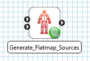
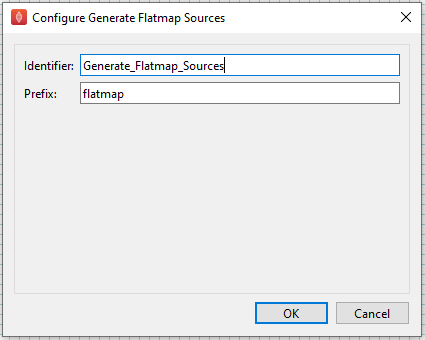

Generate Flatmap Sources
========================

Overview
--------

The **Generate Flatmap Sources** is a MAP Client plugin for generating the content files used for generating a flatmap.

.. _fig-mcp-generate-flatmap-sources-configured-step:

   A configured *Generate Flatmap Sources* default step icon.

Specification
-------------

Information on this plugins' specification is available :ref:`here <mcp-generateflatmapsources-specification>`.

Configuration
-------------

In this plugin the two parameters that can be configured are the,

* Identifier, and
* Prefix.

The *identifier* is used to uniquely identifier the step.
The *prefix* is prefixed to the names of the created flatmap source files.

.. _fig-mcp-generate-flatmap-sources-configure-dialog:

   Generate flatmap sources step configuration dialog.

Instructions
------------

This is a non-interactive step.
See `Configuration`_.
